<div align="center">



</div>

<div align="center">

[](https://git.io/typing-svg)

<br/>

[](https://github.com/vignesh2027/Claude-Agentic-Skills2.0-version/stargazers)
[](https://github.com/vignesh2027/Claude-Agentic-Skills2.0-version/network/members)
[](LICENSE)
[](#skills-index)
[](https://claude.ai)
[](prompts/)
[](CONTRIBUTING.md)

</div>

---

> **AgentOS 2.0** is the world's most comprehensive collection of production-grade Claude Skills — **96+ modular AI agents** you drop into Claude to unlock institutional-depth expertise across finance, engineering, data science, legal, healthcare, Web3, biotech, climate, and more.

---

## How to Use a Skill (60 seconds)

### Claude.ai Projects — Recommended
```
1. claude.ai → Projects → New Project
2. Project Instructions → paste any SKILL.md content
3. Every chat in that project uses that agent
```

### Claude Code (CLI)
```bash
# Single skill
cat quant-trader/SKILL.md >> .claude/CLAUDE.md

# Multiple skills
cat senior-dev/SKILL.md rag-architect/SKILL.md >> .claude/CLAUDE.md

# Full AgentOS (all 96+ agents)
cat agentOS-orchestrator/SKILL.md >> .claude/CLAUDE.md
```

### Claude API (Python)
```python
import anthropic

with open("quant-trader/SKILL.md") as f:
    skill = f.read()

client = anthropic.Anthropic()
response = client.messages.create(
    model="claude-sonnet-4-6",
    max_tokens=8096,
    system=skill,
    messages=[{"role": "user", "content": "Give me a trade signal on NVDA"}]
)
print(response.content[0].text)
```

### Cursor / Windsurf / IDE
Paste any `SKILL.md` content into `.cursor/rules`, `.windsurfrules`, or your IDE's AI custom instructions.

---

## Demo: QuantTrader Skill in Action

> **How to record your own demo GIF (QuickTime on Mac):**
> 1. Open Terminal → `cat quant-trader/SKILL.md` → copy the content
> 2. Open Claude.ai → create a new Project → paste into Project Instructions
> 3. Open **QuickTime Player** → File → **New Screen Recording** → select your browser window
> 4. Type: *"Give me a trade signal on NVDA with full risk analysis"*
> 5. Stop recording → File → Export → 1080p
> 6. Convert to GIF: `ffmpeg -i recording.mov -vf "fps=10,scale=800:-1" demo.gif`
> 7. Add `demo.gif` to this repo and reference it here

*[Add your demo GIF here — a 30-second recording of any skill in action will 3× your star conversion rate]*

---

## Skills Index

### 💹 Finance & Investment (8 Skills)

| Skill | What It Does |
|-------|-------------|
| [quant-trader](quant-trader/SKILL.md) | JSON trade signals with entry/target/stop/R:R, Kelly sizing, regime detection (trending/ranging/volatile) |
| [cfo-intelligence](cfo-intelligence/SKILL.md) | P&L parsing, 3-statement financial model, budget variance root cause, board-ready summaries |
| [risk-sentinel](risk-sentinel/SKILL.md) | VaR (95%/99%), CVaR, Monte Carlo, ISO 31000 + COSO ERM, risk heat map, KRIs |
| [ma-dealmaker](ma-dealmaker/SKILL.md) | DCF, LBO, EV/EBITDA comps, quality-of-earnings review, synergy modeling, IC memos |
| [crypto-sage](crypto-sage/SKILL.md) | On-chain: MVRV, SOPR, NVT, whale flows; DeFi TVL; tokenomics; rug pull indicators |
| [portfolio-optimizer](portfolio-optimizer/SKILL.md) | MPT efficient frontier, factor exposure (value/momentum/quality), tax-loss harvesting |
| [esg-compass](esg-compass/SKILL.md) | Scope 1/2/3, 20-metric ESG scoring, TCFD/SFDR compliance, net-zero pathway |
| [compliance-ai](compliance-ai/SKILL.md) | KYC/AML/PEP screening, transaction monitoring, SOX/PCI/GDPR audit prep |

### 🤖 AI & Engineering (14 Skills)

| Skill | What It Does |
|-------|-------------|
| [rag-architect](rag-architect/SKILL.md) | Hybrid RAG: semantic chunking → pgvector/Pinecone → BM25 + dense → re-rank → citation grounding |
| [agent-smith](agent-smith/SKILL.md) | Multi-agent topology design, semantic routing, tool schemas, memory architecture, eval frameworks |
| [senior-dev](senior-dev/SKILL.md) | Complete Next.js 14 + FastAPI code: TypeScript strict, full error handling, OWASP security |
| [data-pipeline-pro](data-pipeline-pro/SKILL.md) | dbt model layers, Airflow DAG design, Spark at scale, data quality validation |
| [mlops-engineer](mlops-engineer/SKILL.md) | MLflow, feature store design, PSI drift detection, A/B + shadow mode deployment |
| [devops-commander](devops-commander/SKILL.md) | GitHub Actions CI/CD, multi-stage Docker, Kubernetes manifests, Terraform, Prometheus |
| [security-chief](security-chief/SKILL.md) | STRIDE threat modeling, OWASP top 10, SOC2/ISO 27001/NIST CSF, SIEM log analysis |
| [api-integrator](api-integrator/SKILL.md) | OpenAPI 3.0, OAuth 2.0, HMAC webhook verification, n8n/Zapier automation patterns |
| [prompt-engineer](prompt-engineer/SKILL.md) | System prompt design, few-shot examples, CoT, eval frameworks, injection prevention |
| [mcp-builder](mcp-builder/SKILL.md) | MCP server design in Python + TypeScript, tool/resource/prompt primitives, Claude Desktop config |
| [voice-agent-builder](voice-agent-builder/SKILL.md) | Sub-300ms voice AI pipelines: Deepgram ASR → Claude → ElevenLabs TTS, Twilio/Vapi telephony |
| [knowledge-graph-builder](knowledge-graph-builder/SKILL.md) | Entity extraction, Neo4j/RDF graph construction, Cypher queries, GraphRAG multi-hop reasoning |
| [ai-red-teamer](ai-red-teamer/SKILL.md) | Adversarial LLM testing: OWASP LLM Top 10, jailbreak taxonomy, P0-P3 severity ratings |
| [incident-commander](incident-commander/SKILL.md) | Production incident response: SEV1-4 triage, 5-Whys post-mortem, runbooks, stakeholder comms |

### 📊 Data & Analytics (10 Skills)

| Skill | What It Does |
|-------|-------------|
| [data-scientist-pro](data-scientist-pro/SKILL.md) | EDA, feature engineering, model selection, Bayesian hypertuning, SHAP interpretation |
| [timeseries-oracle](timeseries-oracle/SKILL.md) | ARIMA/Prophet/LSTM, anomaly detection (IsolationForest/DBSCAN), prediction intervals |
| [business-intelligence-pro](business-intelligence-pro/SKILL.md) | North star + metric trees, LookML, window functions, cohort SQL, BI alerting |
| [realtime-data-agent](realtime-data-agent/SKILL.md) | Kafka topic design, Spark Streaming, WebSocket server, event schema, latency budgets |
| [database-genius](database-genius/SKILL.md) | Schema design, composite/partial/covering indexes, EXPLAIN analysis, pgvector AI workloads |
| [abtest-scientist](abtest-scientist/SKILL.md) | Power analysis, Bayesian/frequentist, Bonferroni/BH correction, DiD, synthetic control |
| [sql-analyzer](sql-analyzer/SKILL.md) | Query optimization, window functions, recursive CTEs, N+1 elimination, index strategy |
| [data-governance-agent](data-governance-agent/SKILL.md) | Data catalog, PII classification tiers, data quality scoring, GDPR retention policies |
| [synthetic-data-generator](synthetic-data-generator/SKILL.md) | CTGAN/Gaussian copulas for tabular data, differential privacy, statistical fidelity audit |
| [arxiv-researcher](arxiv-researcher/SKILL.md) | Academic paper deconstruction, SOTA comparison tables, red flags checklist, literature reviews |

### 🏢 Operations & Business (12 Skills)

| Skill | What It Does |
|-------|-------------|
| [product-strategy](product-strategy/SKILL.md) | Full PRD writing, RICE scoring, north star metric, LTV/CAC, competitive positioning |
| [sales-intelligence](sales-intelligence/SKILL.md) | ICP scoring, 5-touch sequences, MEDDPICC deal health, bottom-up sales forecasting |
| [b2b-sales-playbook](b2b-sales-playbook/SKILL.md) | Enterprise deal navigation, MEDDPICC, discovery call framework, business case writing |
| [marketing-os](marketing-os/SKILL.md) | Keyword clustering, ROAS + attribution, AIDA/PAS copywriting, brand voice |
| [customer-success](customer-success/SKILL.md) | Churn prediction signals, NPS driver analysis, onboarding sequences, escalation playbooks |
| [legal-eagle](legal-eagle/SKILL.md) | Contract clause extraction, GDPR/CCPA/SOX gaps, NDA review — not legal advice |
| [hr-analytics](hr-analytics/SKILL.md) | Attrition prediction, bias-reduced JD writing, comp benchmarking, OKR templates |
| [supply-chain-oracle](supply-chain-oracle/SKILL.md) | Demand forecasting, EOQ + safety stock, ABC analysis, disruption stress testing |
| [project-command](project-command/SKILL.md) | WBS, RAID log, sprint velocity, RACI matrix, weekly status reports |
| [pricing-strategist](pricing-strategist/SKILL.md) | Pricing model selection, value-based design, Van Westendorp research, price change modeling |
| [saas-metrics-analyst](saas-metrics-analyst/SKILL.md) | ARR/MRR, GRR/NRR, LTV/CAC, Rule of 40, magic number, benchmarks by ARR stage |
| [financial-model-builder](financial-model-builder/SKILL.md) | 3-statement model, revenue driver models, sensitivity tables, scenario switcher |

### 📝 Content, Research & Growth (12 Skills)

| Skill | What It Does |
|-------|-------------|
| [research-intelligence](research-intelligence/SKILL.md) | TAM/SAM/SOM methodology, competitive positioning map, trend identification with evidence |
| [technical-writer-pro](technical-writer-pro/SKILL.md) | GitHub README, OpenAPI docs with code examples, operational runbooks, wiki architecture |
| [presentation-maestro](presentation-maestro/SKILL.md) | Conflict-resolution narrative arc, per-slide structure, chart selection, BLUF for executives |
| [content-research-writer](content-research-writer/SKILL.md) | Research + writing: articles, tutorials, case studies, thought leadership with voice preservation |
| [innovation-catalyst](innovation-catalyst/SKILL.md) | JTBD, SCAMPER, Blue Ocean, BMC all 9 blocks, MVP scoping |
| [learning-coach](learning-coach/SKILL.md) | Bloom's taxonomy, Socratic method, spaced repetition schedule, quiz design |
| [newsletter-engine](newsletter-engine/SKILL.md) | Subject line formulas, 7-email onboarding sequence, referral mechanics, open rate benchmarks |
| [seo-auditor](seo-auditor/SKILL.md) | Technical SEO audit, Core Web Vitals, keyword gap analysis, on-page optimization checklist |
| [developer-advocate](developer-advocate/SKILL.md) | DevRel strategy, technical blog structure, community metrics, conference talk proposals |
| [podcast-producer](podcast-producer/SKILL.md) | Full episode scripts, show notes, SEO metadata, thumbnail briefs, weekly content calendar |
| [video-content-creator](video-content-creator/SKILL.md) | YouTube/TikTok scripts, hook formulas, thumbnail composition, channel SEO, content calendar |
| [arxiv-researcher](arxiv-researcher/SKILL.md) | Academic paper analysis, SOTA comparison, reproduction notes, critical evaluation framework |

### 🌐 Specialized Domains (12 Skills)

| Skill | What It Does |
|-------|-------------|
| [healthcare-analytics](healthcare-analytics/SKILL.md) | HIPAA-safe, HEDIS measures, LACE readmission index, capacity planning |
| [real-estate-intelligence](real-estate-intelligence/SKILL.md) | Cap rate, NOI, DSCR, IRR, equity multiple, full CRE due diligence checklist |
| [insurance-actuary](insurance-actuary/SKILL.md) | Loss ratio, chain ladder IBNR, reinsurance treaty design, fraud signals |
| [web3-developer](web3-developer/SKILL.md) | Gas-optimized Solidity, reentrancy/flash loan detection, Foundry fuzz + fork tests |
| [growth-hacking](growth-hacking/SKILL.md) | AARRR funnel, k-factor viral loop, Hooked model retention, channel ROI scoring |
| [quant-researcher](quant-researcher/SKILL.md) | Hypothesis design, Fama-MacBeth, academic paper structure, robustness checklists |
| [startup-advisor](startup-advisor/SKILL.md) | Pitch deck review, unit economics health check, fundraising stage strategy, moat scoring |
| [patent-analyst](patent-analyst/SKILL.md) | Prior art search, claim scope, FTO methodology, patent landscape, IP strategy |
| [climate-tech-analyst](climate-tech-analyst/SKILL.md) | GHG Scope 1/2/3, TCFD risk, clean energy LCOE, SBTi targets, carbon offset quality |
| [biotech-analyst](biotech-analyst/SKILL.md) | Clinical pipeline PoS, rNPV valuation, FDA expedited programs, indication competitive map |
| [cybersecurity-analyst](cybersecurity-analyst/SKILL.md) | MITRE ATT&CK mapping, threat hunting hypotheses, DFIR phases, threat intel reports |
| [supply-chain-optimizer](supply-chain-optimizer/SKILL.md) | Network design, center of gravity, last-mile cost, digital twin, FTZ compliance |

### 🛠 Developer Tools & Productivity (13 Skills)

| Skill | What It Does |
|-------|-------------|
| [code-reviewer](code-reviewer/SKILL.md) | Correctness + security + performance + architecture review with severity-labeled findings |
| [webapp-tester](webapp-tester/SKILL.md) | Playwright E2E, pytest API integration, test strategy pyramid, accessibility testing |
| [document-processor](document-processor/SKILL.md) | DOCX, PDF, PPTX, XLSX extraction, comparison, outline generation |
| [meeting-analyzer](meeting-analyzer/SKILL.md) | Action items with owners/dates, decisions, blockers, follow-up email drafting |
| [system-architect](system-architect/SKILL.md) | System design, monolith vs microservices, CAP theorem, ADR templates, HA design |
| [github-intelligence](github-intelligence/SKILL.md) | Repo health scoring, bus factor analysis, SEO optimization, star growth playbook |
| [multi-modal-analyst](multi-modal-analyst/SKILL.md) | Chart extraction, UI screenshot analysis, architecture diagram review, scanned doc OCR |
| [agentic-workflow-builder](agentic-workflow-builder/SKILL.md) | ReAct/Plan-Execute patterns, HITL approval gates, error recovery, cost control |
| [load-tester](load-tester/SKILL.md) | k6/Locust scripts, P50/P95/P99 SLA validation, bottleneck identification, scaling recommendations |
| [code-migrator](code-migrator/SKILL.md) | Framework/language migrations: JS→TS, React class→hooks, monolith→microservices, phased playbook |
| [mcp-builder](mcp-builder/SKILL.md) | MCP server in Python/TypeScript, tool schemas, Claude Desktop config, resources/prompts |

### 👤 Customer & Product (5 Skills)

| Skill | What It Does |
|-------|-------------|
| [churn-analyst](churn-analyst/SKILL.md) | Cohort churn analysis, NRR/GRR decomposition, exit interviews, customer save playbook |
| [onboarding-designer](onboarding-designer/SKILL.md) | Aha moment identification, onboarding checklist design, B2B journey, email drip |
| [customer-segmentation](customer-segmentation/SKILL.md) — *coming soon* | RFM analysis, behavioral segmentation, ICP scoring, persona development |
| [contract-drafter](contract-drafter/SKILL.md) | Commercial contract drafting, NDA templates, SaaS agreement key terms, redlining guide |
| [ui-ux-designer](ui-ux-designer/SKILL.md) | Nielsen's 10 heuristics, WCAG 2.1 AA, user flow friction scoring, design system specs |

### 🎛 Orchestration (1 Skill)

| Skill | What It Does |
|-------|-------------|
| [agentOS-orchestrator](agentOS-orchestrator/SKILL.md) | Activates ALL 96+ agents — auto-routes tasks, decomposes work, synthesizes outputs |

---

## What Makes These Skills Different

**Every skill includes things most repos don't:**

| Feature | Generic Skill Repos | AgentOS 2.0 |
|---------|-------------------|-------------|
| Named sub-agents | Rarely | Every skill |
| Actual formulas | Never | VaR, DCF, EOQ, Kelly, rNPV... |
| Output format with example | Sometimes | Always |
| Forbidden behaviors / constraints | Never | Every skill |
| Domain-specific frameworks | Never | STRIDE, COSO, HEDIS, MEDDPICC, ATT&CK, TCFD |
| Finance depth | None | Institutional-grade |
| New 2025-era agents | N/A | VoiceAgent, AIRedTeamer, KnowledgeGraph, SyntheticData, IncidentCommander, LoadTester |
| Total skills | ~10-20 | **96+** |

---

## Repository Structure

```
Claude-Agentic-Skills2.0-version/
│
├── agentOS-orchestrator/      ← Load this to activate ALL agents
│
├── Finance (8)
│   ├── quant-trader/
│   ├── cfo-intelligence/
│   ├── risk-sentinel/
│   ├── ma-dealmaker/
│   ├── crypto-sage/
│   ├── portfolio-optimizer/
│   ├── esg-compass/
│   └── compliance-ai/
│
├── AI & Engineering (10)
│   ├── rag-architect/
│   ├── agent-smith/
│   ├── senior-dev/
│   ├── data-pipeline-pro/
│   ├── mlops-engineer/
│   ├── devops-commander/
│   ├── security-chief/
│   ├── api-integrator/
│   ├── prompt-engineer/
│   └── mcp-builder/
│
├── ... (53 more skills across 8 more domains)
│
├── template-skill/            ← Copy this to create a new skill
├── prompts/
│   └── agentOS-system-prompt.md  ← Full OS as single system prompt
├── index.html                 ← Project website
├── CONTRIBUTING.md
└── README.md
```

---

## Recording a Demo GIF

A 30-second GIF showing the skill in action will **3× your star conversion rate** vs text alone.

### Step-by-step (Mac — QuickTime)

```bash
# Step 1: Prepare Claude
# Open claude.ai → Projects → New Project
# Paste quant-trader/SKILL.md into Project Instructions

# Step 2: Record
# QuickTime Player → File → New Screen Recording
# Select your browser window only (not full screen)
# Type your prompt and hit enter — Claude activates with the agent header

# Step 3: Convert recording to GIF
# Install ffmpeg if needed:
brew install ffmpeg

# Convert .mov to GIF (800px wide, 10fps — good quality + small size)
ffmpeg -i ~/Desktop/recording.mov \
  -vf "fps=10,scale=800:-1:flags=lanczos,split[s0][s1];[s0]palettegen[p];[s1][p]paletteuse" \
  -loop 0 demo.gif

# Step 4: Optimize (optional, makes file smaller)
brew install gifsicle
gifsicle -O3 --lossy=80 demo.gif -o demo-optimized.gif
```

### Best GIFs to Record (highest impact)
1. `quant-trader` — type "Give me a signal on NVDA" → shows JSON output with activation box
2. `rag-architect` — type "Build a RAG system for my PDF docs" → shows architecture output
3. `agentOS-orchestrator` — type "Analyze Apple earnings and give me a trade signal" → shows multi-agent routing

---

## SEO & Promotion Playbook

### Step 1 — GitHub Repository SEO (do this now)
Go to your repo → click the ⚙️ gear next to "About" → add all 20 topics:

```
claude  anthropic  ai-agents  claude-skills  multi-agent  llm
prompt-engineering  finance-ai  rag  system-prompt  agentic-ai
mlops  devops  data-science  openai-alternative  claude-code
machine-learning  developer-tools  autonomous-agents  langchain
```

**Repository description** (copy-paste into About):
```
73+ production Claude Skills for finance, engineering, data, legal, healthcare & Web3.
The deepest multi-agent AI skills repository for Claude 4.x.
```

### Step 2 — Launch Day (post all simultaneously for velocity)

**Hacker News** — post Tuesday–Thursday 9 AM PT:
```
Show HN: 73+ specialist Claude Skills — finance (VaR, DCF, trade signals),
engineering (RAG, multi-agent, DevOps), healthcare, Web3, and more
```

**Reddit** — post to all of these:
- r/ClaudeAI
- r/LocalLLaMA
- r/MachineLearning
- r/ChatGPTPromptEngineering
- r/artificial
- r/programming (show a code output from `senior-dev` or `rag-architect`)

**X / Twitter** — screenshot of the activation header + one impressive output:
```
Just dropped 73+ Claude Skills for free.

Finance: VaR calculation, DCF models, trade signals with R:R
Engineering: full RAG pipelines, multi-agent systems, Kubernetes
Healthcare: HIPAA-safe analytics, readmission risk
Web3: gas-optimized Solidity, Foundry tests

Drop any SKILL.md into Claude and it becomes a specialist.

github.com/vignesh2027/Claude-Agentic-Skills2.0-version
```

**LinkedIn**:
```
I built 73+ Claude Skills covering finance, engineering, data science,
legal, healthcare, Web3, biotech, and climate.

Each skill is a standalone SKILL.md file — paste it into Claude
and get a specialist agent with real domain depth.

[Finance skills include actual VaR formulas, DCF models, Kelly sizing]
[Engineering skills include full RAG architectures, multi-agent patterns]

Link in comments.
```

**Product Hunt** — submit at 12:01 AM PT:
- Tagline: "73+ specialist Claude Skills for finance, engineering, data & more"
- First comment: explain the problem you solve and top 3 most impressive skills

### Step 3 — The Star Flywheel

```
Quality Content
      │
      ▼
Post in Communities (Velocity)
      │
      ▼
GitHub Trending (50-100 stars/day)
      │
      ▼
Organic Discovery + Google Indexing
      │
      ▼
More Stars → Higher Google Ranking → More Stars
```

**Key insight**: 50-100 stars in a single 24-hour window can trigger GitHub Trending.
That single Trending appearance can drive 500-2,000+ organic stars.

### Step 4 — Ongoing Growth

- Every 2 weeks: add 5-10 new skills and post an update tweet
- Monthly: write a blog post showing a skill in action (dev.to, Medium, Hashnode)
- Watch GitHub Explore for trending tags and update your topics to match

---

## Skill Format

Every skill follows the Claude Skills standard:

```markdown
---
name: skill-name
description: >
  Precise description of when and how to use this skill.
  This is used by Claude for skill matching and intent routing.
license: MIT
---

# Skill Name Agent

[Sub-agents, workflows, frameworks, output formats, constraints...]
```

---

## Contributing

See [CONTRIBUTING.md](CONTRIBUTING.md). Use [template-skill](template-skill/SKILL.md) as your starting point.

---

## License

MIT — free to use, modify, and build on. See [LICENSE](LICENSE).

---

<div align="center">

**Built by [@vignesh2027](https://github.com/vignesh2027)**

*If AgentOS saves you time or teaches you something, a ⭐ star keeps it discoverable for others.*

<br/>

[](https://github.com/vignesh2027/Claude-Agentic-Skills2.0-version)


</div>
